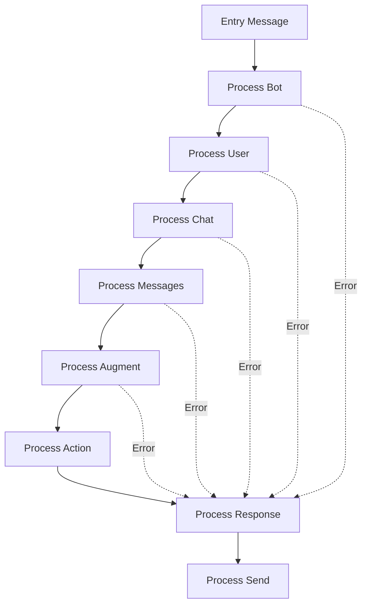

# Erixcel Engine 🚀

## 📋 Descripción

Erixcel Engine es una plataforma avanzada de automatización conversacional construida con **NestJS** y **TypeScript**, diseñada para crear y gestionar agentes de IA inteligentes para WhatsApp Business. La aplicación integra múltiples modelos de lenguaje (OpenAI GPT, Google Gemini) y utiliza **LangChain** y **LangGraph** para orquestar flujos conversacionales complejos.

## 🏗️ Arquitectura

### Módulos Principales

#### 🤖 Agent Engine
El núcleo de la aplicación que maneja el flujo conversacional mediante un sistema de nodos interconectados:

- **Flow Service**: Orquestador principal usando LangGraph para el manejo de estados
- **Process Nodes**: Conjunto de servicios especializados para cada etapa del flujo:
  - `ProcessBotService`: Validación y configuración del bot
  - `ProcessUserService`: Gestión de datos del usuario
  - `ProcessChatService`: Manejo de sesiones de chat
  - `ProcessMessagesService`: Procesamiento de mensajes
  - `ProcessAugmentService`: Enriquecimiento de contexto
  - `ProcessActionService`: Ejecución de acciones
  - `ProcessResponseService`: Generación de respuestas
  - `ProcessSendService`: Envío de mensajes

#### 💬 Conversation
Sistema de gestión de conversaciones con memoria persistente:
- **Memory Management**: Memoria de conversación con buffer de tokens
- **Vector Memory**: Memoria vectorial para recuperación de contexto relevante
- **MongoDB Integration**: Almacenamiento de conversaciones en MongoDB Atlas

#### 🔍 Embedding
Servicio de procesamiento y gestión de embeddings:
- **OpenAI Embeddings**: Generación de vectores usando modelos de OpenAI
- **Pinecone Integration**: Almacenamiento vectorial en Pinecone
- **MongoDB Vector Search**: Búsqueda vectorial en MongoDB Atlas
- **Text Splitting**: División inteligente de documentos

#### 🗄️ Schema
Servicio para extracción estructurada de datos:
- **Structured Output**: Extracción de objetos estructurados usando Zod schemas
- **Conversation Analysis**: Análisis de conversaciones para extraer información específica

#### 📊 Client
Servicio centralizado para gestión de clientes de IA:
- **Multi-Model Support**: Soporte para OpenAI GPT y Google Gemini
- **Embedding Services**: Servicios de embeddings centralizados
- **Database Connections**: Conexiones a MongoDB y Pinecone

## 🛠️ Tecnologías

### Backend
- **NestJS**: Framework de Node.js para aplicaciones escalables
- **TypeScript**: Tipado estático para JavaScript
- **LangChain**: Framework para aplicaciones con LLM
- **LangGraph**: Biblioteca para flujos de trabajo con grafos

### Bases de Datos y Vectores
- **MongoDB Atlas**: Base de datos principal con búsqueda vectorial
- **Pinecone**: Base de datos vectorial especializada
- **Supabase**: (En desarrollo) Base de datos adicional

### Modelos de IA
- **OpenAI GPT-4**: Modelo principal de conversación
- **Google Gemini**: Modelo alternativo de IA
- **OpenAI Embeddings**: Para generación de vectores

### Integraciones
- **WhatsApp Business API**: Comunicación con usuarios
- **Meta Provider**: Integración con servicios de Meta
- **Evolution API**: API de WhatsApp no oficial
- **LangSmith**: Monitoreo y trazabilidad de LLM

## 🚀 Instalación

### Prerequisitos
- Node.js >= 18
- npm o yarn
- MongoDB Atlas
- Pinecone account
- OpenAI API Key
- Google AI API Key

### Configuración

1. **Clonar el repositorio**
```bash
git clone <repository-url>
cd erixcel-engine
```

2. **Instalar dependencias**
```bash
npm install
```

3. **Variables de entorno**
```bash
cp .env.example .env
```

Configurar las siguientes variables:
```env
# Server
PORT=3200

# OpenAI
OPENAI_API_KEY=your_openai_api_key

# Google AI
GOOGLE_API_KEY=your_google_api_key

# MongoDB
ATLAS_CONNECTION_STRING=your_mongodb_connection_string

# Pinecone
PICONE_API_KEY=your_pinecone_api_key

# LangSmith (opcional)
LANGCHAIN_TRACING_V2=true
LANGCHAIN_API_KEY=your_langsmith_api_key
```

4. **Ejecutar la aplicación**
```bash
# Desarrollo
npm run start:dev

# Producción
npm run build
npm run start:prod
```

## 📖 API Endpoints

### Agent Engine
- `POST /agent-engine/flow-development`: Ejecuta el flujo de desarrollo del agente

### Conversation
- `POST /conversation/run`: Ejecuta una conversación
- `GET /conversation/memory/:chatId`: Obtiene la memoria de una conversación

### Embedding
- `POST /embedding/create`: Crea embeddings para un documento
- `POST /embedding/search`: Busca documentos similares
- `POST /embedding/pinecone/upsert`: Almacena vectores en Pinecone
- `POST /embedding/mongo/upsert`: Almacena vectores en MongoDB

### Schema
- `POST /schema/extract`: Extrae datos estructurados de conversaciones

## 🔄 Flujo de Procesamiento



## 📁 Estructura de Datos

### NodePayload
```typescript
interface NodePayload {
  entry: Entry;           // Datos del mensaje entrante
  bot?: Bot;             // Configuración del bot
  user?: User;           // Información del usuario
  instance?: Instance;   // Configuración de la instancia
  chat?: Chat;           // Datos de la sesión de chat
  messages?: Message[];  // Historial de mensajes
}
```

### Entry
```typescript
interface Entry {
  is_local: boolean;
  is_test: boolean;
  code: string;
  whatsapp_type: 'official' | 'unofficial';
  provider_type: 'meta' | 'evolution-api' | 'waapi';
  phone_bot: string;
  phone_user: string;
  text?: string;
  type?: 'text' | 'audio' | 'image' | 'document';
  // ... más campos
}
```

## 🧪 Testing

```bash
# Tests unitarios
npm run test

# Tests con watch
npm run test:watch

# Coverage
npm run test:cov

# Tests e2e
npm run test:e2e
```

## 📚 Documentación API

La documentación completa de la API está disponible en:
```
http://localhost:3200/api
```

## 🤝 Contribución

1. Fork el proyecto
2. Crea una rama para tu feature (`git checkout -b feature/AmazingFeature`)
3. Commit tus cambios (`git commit -m 'Add some AmazingFeature'`)
4. Push a la rama (`git push origin feature/AmazingFeature`)
5. Abre un Pull Request

## 📋 Scripts Disponibles

- `npm run build`: Construye la aplicación
- `npm run start`: Inicia la aplicación
- `npm run start:dev`: Inicia en modo desarrollo con hot-reload
- `npm run start:debug`: Inicia en modo debug
- `npm run lint`: Ejecuta el linter
- `npm run format`: Formatea el código

## 🔐 Seguridad

- Todas las API keys deben ser configuradas como variables de entorno
- Implementa autenticación según tus necesidades
- Revisa regularmente las dependencias por vulnerabilidades

## 📄 Licencia

Este proyecto está bajo licencia privada. Ver archivo `LICENSE` para más detalles.

## 👥 Equipo

- **Erixcel** - Desarrollo principal

## 📞 Soporte

Para soporte técnico, contacta:
- Email: support@erixcel.com
- GitHub Issues: [Crear issue](../../issues)

---

⚡ **Powered by NestJS, LangChain & OpenAI**
